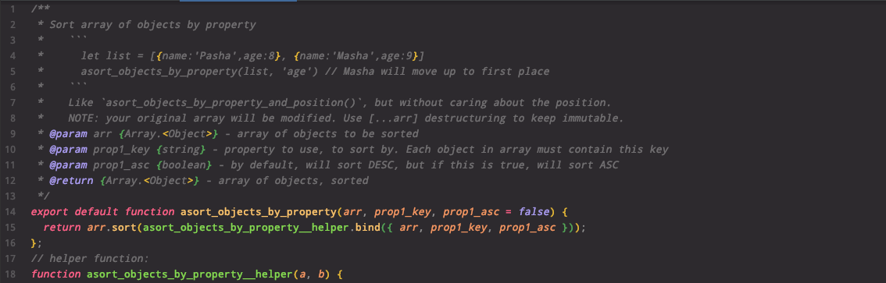

# 📚 universal-common-scripts 📚

Library of useful functions like underscore/lodash. Very small. No dependencies. A collection of various random useful scripts for data manipulation and modern web development.
<p>&nbsp;</p>

# Installation:

For now, **this can only be imported as an ES Module, for compatibility with front-end compilers like Webpack**. If you already use ESM, **high five**! If your Node.js project still uses CJS (CommonJS), please read on...

> ESM is the new standard on the web, but Node app deverlopers are slow to convert, because it's a pain in the butt. This is probably one reason why there are still so few Node.js back-ends. **The main benefit to Node.js is being able to use the same code on front-end and back-end. Ironically, this was not possible until recently.**

1. **Use this easy shortcut [npm esm package](https://www.npmjs.com/package/esm) to include ES Modules into your CommonJS project:** \
  [ESM documentation on GitHub](https://github.com/standard-things/esm) (also a great read: [release statement from 2018](https://medium.com/web-on-the-edge/tomorrows-es-modules-today-c53d29ac448c)) \
  (1) wrap your project code in a decorator function (2) or add `esm` as a flag when you start your server

2. **Or, convert your Node.js app to ESM,** (1) add `"type":"module"` to `package.json`, and (2) start your server with the `--experimental-specifier-resolution=node` flag. Go through your entire code base, and convert all `require` statements to `import`. Then make sure that all your node_modules are still compatible. Fun! But good to do if you're just starting out. You'll still be able to include CommonJS files as before.

### Import:
  ```
  import { asort_by_rating_and_position } from "universal-common-scripts/src/asort_strings"
  // or:
  import string_sort_functions from "universal-common-scripts/src/asort_strings"
  // or:
  import everything from "universal-common-scripts"
  ```

<p>&nbsp;</p>

# Library of functions:

### Example: `asort_by_rating_and_position()` algorithmic sort function:

You have a list of cities, ordered from your most to least favorite, and a cost of living index for each:
```
let cities = ['Zurich', 'Paris', 'Kansas City', 'New York', 'Copenhagen', 'Duluth']
let ratings = { 'Zurich':1, 'Paris':1, 'Kansas City':10, 'New York':5, 'Copenhagen':5, 'Duluth':7 }

console.log(asort_by_rating_and_position(cities, ratings, 0.1))
```
The output will be something like this:
```
['Kansas City', 'New York', 'Duluth', 'Copenhagen', 'Zurich', 'Paris']
```
'Kansas City' jumped 2 spots, because it's rating was very high. Duluth jumped one spot ahead because it's rating was also pretty high. The first 2 cities dropped far down because their ratings were very low compared to the others.

The third parameter specifies how much preference is given to the original order. High number will make it hardly budge at all. Low number will make higher rated items float to the top more easily. See [documentation](#documentation-coming-soon).

**This is much more useful with a much larger dataset of course!**
<p>&nbsp;</p>

### Other functions:

`str_hash()` to make a unique number out of a long or short string of text. Not for security or cryptography, but helps a lot to make a unique ID.

`syllable_count()` returns number of syllables for a given word

`ends_in_vowel()` returns true if the input word ends in a vowel

`asort_objects_by_property()` just like `asort_by_rating_and_position()`, but instead of taking a list of items and object of ratings as separate parameters, it takes a list of objects, and sorts the list based on a property of each object.

`sleep()` returns a Promise after a number of milliseconds. Use with async/await to mimic other programming languages like Bash

`forEachAsync()` returns a Promise when finished - executes a number of promises synchronously - good for executing an async callback on each item in an array

`parse_error_message()` Error messages come in all shapes and sizes. From simple string, to standard `new Error('...')` to Axios/fetch promises containing an error... Returns a string which you can display to your user, without fear.

And many more...
<p>&nbsp;</p>

# Documentation pages coming soon

For now, please read the JSDoc (comments) above each function in the [./src](https://github.com/paulshorey/universal-common-scripts/tree/main/src) folder:


<p>&nbsp;</p>

# About

I use these functions in https://besta.domains, https://wordio.co, https://paulshorey.com, and others. I treat these as my code snippets. If it seems like it will be useful in the future, not just for the project at hand, but for many different projects, then I include the script into this library. If you'd like to contribute, please don't be shy. Lets build something together! ~ [Paul Shorey .com](https://paulshorey.com)


