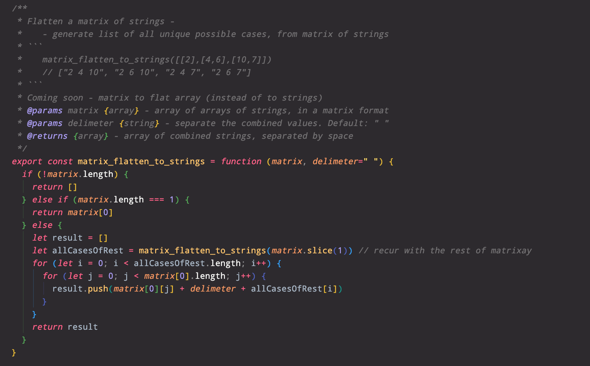

# 📚 pauls-pure-functions 📚

Library of useful functions like underscore/lodash. Very small. No dependencies. A collection of various random useful scripts for data manipulation and modern web development. Please contribute.

<p>&nbsp;</p>

[](https://www.npmjs.com/package/pauls-pure-functions)
**Try it out in CodeSandbox.io:** \
https://codesandbox.io/s/pauls-pure-functions-demo-esm-cculn
<p>&nbsp;</p>

# Why?

Unlike Lodash, these functions are not limited to common data structures, but web development in general - like parsing URLs, making HTTP requests, seeing if the browser screen is Retina or not (that's not pure, but it's useful). My name for this library really needs some thought.

I did not want to constantly re-invent the wheel and search for code snippets. Some of these functions are just like Lodash, but offer extra functionality (or less functionality). It all depends on the individual function.

Currently working on testing and documenting this library. Just finished the build process for browsers!

I'm still adding functions and changing existing ones. Will be renaming all the function and changing the structure. **PLEASE NOTE: this project (currently `version 0`) will not be stable until `version 1`.** Contact me (I don't have a mailing list) to be notified when this becomes stable and complete (probably not for another year).

<p>&nbsp;</p>

# Also check out:
- [numjs](https://github.com/nicolaspanel/numjs){:target="_blank"} - JS version of Python's numpy
<p>&nbsp;</p>

# Installation:

## Node.js ES6 Modules
High five! Shake that tree!
  ```
  // NOTE: import from "esm" folder:
  import { sort_by_rating_and_position } from "pauls-pure-functions/esm/sort_strings"
  // or:
  import * as string_sort_functions from "pauls-pure-functions/esm/sort_strings"
  // or:
  import everything from "pauls-pure-functions"
  ```

## Node.js Common JS
consider converting your project to {"type":"module"}. Or use the handy [npm esm package](https://www.npmjs.com/package/esm)
  ```
  // NOTE: import from "cjs" folder:
  const string_sort_functions = require("pauls-pure-functions/esm/sort_strings")
  // or get everything:
  const everything = require("pauls-pure-functions")
  ```

## Browser
this script will create a `window.__` variable** with a flat list of functions. This is different. In Node, you import/require and you choose what to call each variable. **Replace "__" with a specific version number!**
```
  <!-- NOTE: import from "__" folder -->
  <script src="https://cdn.jsdelivr.net/gh/paulshorey/pauls-pure-functions@latest/__/index.js"></script>

  <!-- or get a specific set of functions, without loading the whole library: -->
  <script src="https://cdn.jsdelivr.net/gh/paulshorey/pauls-pure-functions@latest/__/sort_strings.js"></script>
```
The newly created `window.__` object of functions will contain one object called `_map`. It's a reference to which file each function originates from.


<p>&nbsp;</p>

# Library of functions:

### For example: `sort_by_rating_and_position()` algorithmic sort function:

You have a list of cities, ordered from your most to least favorite, and a cost of living index for each:
```
let cities = ['Zurich', 'Paris', 'Kansas City', 'New York', 'Copenhagen', 'Duluth']
let ratings = { 'Zurich':1, 'Paris':1, 'Kansas City':10, 'New York':5, 'Copenhagen':5, 'Duluth':7 }

console.log(sort_by_rating_and_position(cities, ratings, 0.1))
```
The output will be something like this:
```
['Kansas City', 'New York', 'Duluth', 'Copenhagen', 'Zurich', 'Paris']
```
'Kansas City' jumped 2 spots, because it's rating was very high. Duluth jumped one spot ahead because it's rating was also pretty high. The first 2 cities dropped far down because their ratings were very low compared to the others.

The third parameter specifies how much preference is given to the original order. High number will make it hardly budge at all. Low number will make higher rated items float to the top more easily. See [documentation](#documentation-coming-soon).

This is much more useful with a much larger dataset of course!
<p>&nbsp;</p>

### Universal functions:

`str_hash()` to make a unique number out of a long or short string of text. Not for security or cryptography, but helps a lot to make a unique ID.

`syllable_count()` returns number of syllables for a given word

`arr_remove_item()` removes a value from an array, by value

`ends_in_vowel()` returns true if the input word ends in a vowel

`sort_objects_by_property()` just like `sort_by_rating_and_position()`, but instead of taking a list of items and object of ratings as separate parameters, it takes a list of objects, and sorts the list based on a property of each object.

`sleep()` returns a Promise after a number of milliseconds. Use with async/await to mimic other programming languages like Bash

`for_each_promise_all()` returns a Promise - like a [].forEach, executes the function on each value in array - but with Promises

`call_later()` a taste of curry - define the function and arguments seprately, to be called later.

`parse_error_message()` Error messages come in all shapes and sizes. From simple string, to standard `new Error('...')` to Axios/fetch promises containing an error... Returns a string which you can display to your user, without fear.

### For browser only:

`load_script()` loads a script file into your document

`object_from_querystring()` and other URL utils

`is_retina()` true if on MacBook for example, or any other "retina" or higher resolution screen

### For node.js only:

`parse_cli_args()` gets arguments passed to NodeJS process when it was started

### And many more

As I make write (or find on Stackoverflow) a new function for myself/clients/employers, I copy it to this library. Please contribute your own. Let's combine efforts!
See [CodePen example](https://codepen.io/paulshorey/pen/bGweWaB?editors=0012). Play around with all the functions.

<p>&nbsp;</p>

# Documentation pages coming soon

**For now, please read the JSDoc** (comments) above each function in the [./src](https://github.com/paulshorey/pauls-pure-functions/tree/main/src) folder. Please bear with me. I'm currently completing all the documentation. After that's done, will compile it into several markdown files in the `./docs` folder and link to them.


<p>&nbsp;</p>

# About

I use these functions in https://besta.domains, https://wordio.co, https://paulshorey.com, and others. I treat these as my code snippets. If it seems like it will be useful in the future, not just for the project at hand, but for many different projects, then I include the script into this library. If you'd like to contribute, please don't be shy. Lets build something together! ~ [Paul Shorey .com](https://paulshorey.com)


